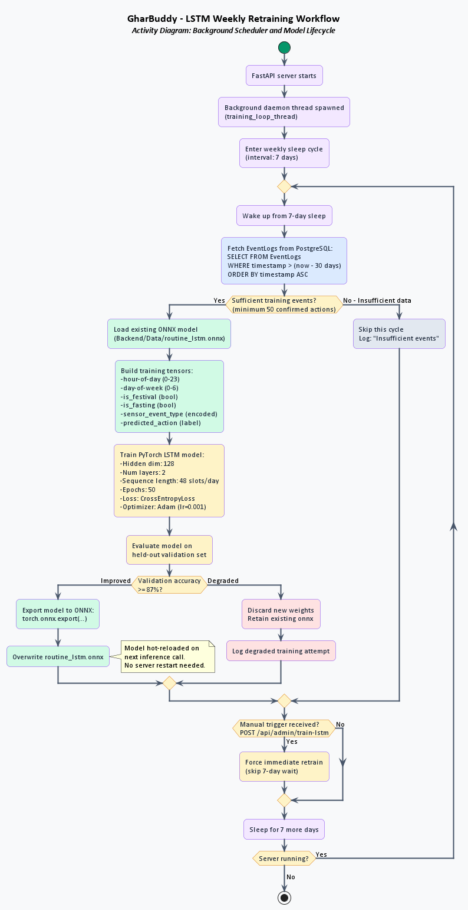
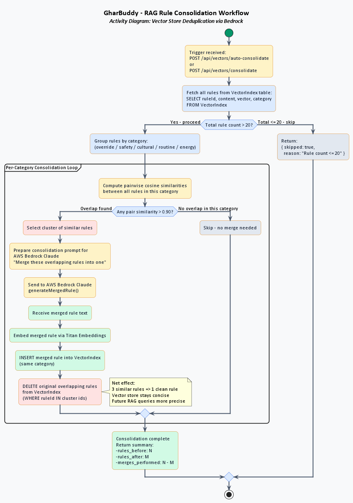

# Artificial Intelligence Agent

The GharBuddy AI agent combines predictive sequence modeling and natural language reasoning to manage home environments proactively.

---

## Machine Learning Architecture

The agent stacks two AI tiers: a local neural sequence classifier for fast, offline routine prediction and a cloud LLM for nuanced reasoning over cultural/energy context.

### 1. PyTorch LSTM Routine Predictor

The LSTM model runs entirely on-device (via ONNX Runtime) and never requires network access for inference.



> **Source:** [`activity_lstm_training.puml`](activity_lstm_training.puml)

**Details:**
- Predicts the next home appliance action from a 30-day event sequence (hour-of-day, day-of-week, sensor type, festival/fasting flags).
- Trained locally using PyTorch (`hidden_dim=128`, `num_layers=2`, `epochs=50`, `CrossEntropyLoss`, `Adam lr=0.001`).
- Model state serialized to `Backend/Data/routine_lstm.onnx` for zero-dependency inference via `onnxruntime`.
- **Softmax Confidence Guard:** Predictions below 0.70 confidence are silently discarded (no action taken).
- **Weekly Retraining:** A daemon thread wakes every 7 days to retrain on fresh `EventLogs` data. Only deploys the new ONNX model if validation accuracy ≥ 87%. Triggerable manually via `POST /api/admin/train-lstm`.

---

### 2. AWS Bedrock Reasoning Engine (Claude 3.5 Sonnet)

Claude acts as the contextual reasoning core. It receives a structured ~600-token situation packet and returns a JSON decision.

**Situation packet fields:**

| Field | Source |
|---|---|
| `simulatedTime` / `simulatedDate` | SystemState |
| `isFastingDay` / `festivalName` | `IndianCalendar` |
| `predictedAction` + `confidence` | LSTM RoutinePredictor |
| `powerStatus` / `loadSheddingRisk` | `LoadSheddingCalendar` |
| `ragContext` | `VectorStoreService` (top-k cosine matches) |
| `whistleCount` | cooker whistle sensor accumulator |

**Conflict Resolution Priority (5 levels, highest first):**

```
1. User Override rules     (category=override)
2. Safety guardrails       (category=safety)
3. Cultural/Fasting rules  (category=cultural)
4. LSTM Routine prediction (category=routine)
5. Energy optimisation     (category=energy)
```

**Output JSON schema:**
```json
{
  "shouldExecute": true,
  "actionId": "turnOnGeyser",
  "confidence": 0.94,
  "reason": "Morning routine detected at 06:06",
  "explanationHindi": "Geyser on kar diya gaya",
  "conflictDetected": false,
  "energySavedWh": 0
}
```

---

### 3. Google Gemini Redirect Engine

- Activates when AWS Bedrock credentials are absent (local development or CI).
- Uses `gemini-2.5-flash` via the Google AI Studio endpoint.
- Performs identical reasoning with the same structured context packet.
- Guards against mock-spy interference during unit tests.

---

### 4. Voice Parser (Whisper + Claude)

- Accepts multipart audio uploads at `POST /api/voice/process`.
- Transcribes Hindi/Hinglish/English speech using `whisper-1` (OpenAI Whisper ASR).
- Sends the transcript to Claude 3.5 Sonnet to map intent to a specific device toggle command.
- Falls back to simple keyword heuristics when Bedrock is unavailable.

---

## Semantic Retrieval-Augmented Generation (RAG)

All user preferences, safety rules, cultural overrides, and routine refinements are stored as 1536-dimensional Titan vector embeddings in PostgreSQL + pgvector and retrieved at inference time.

### RAG Rule Consolidation

Over time, overlapping rules accumulate (e.g., separate weekday and weekend geyser rules). The auto-consolidation endpoint merges them using Bedrock.



> **Source:** [`activity_rag_consolidation.puml`](activity_rag_consolidation.puml)

**Consolidation trigger:** `POST /api/vectors/auto-consolidate`

**Steps:**
1. Fetch all rules from `VectorIndex`.
2. Group by category (`override`, `safety`, `cultural`, `routine`, `energy`).
3. Compute pairwise cosine similarities within each group.
4. For any pair with similarity > 0.90: ask Bedrock to generate a merged rule.
5. Re-embed the merged rule via Titan and insert back into `VectorIndex`.
6. Delete the original overlapping rules.
7. Only runs if total rule count > 20 (skip otherwise).

### Embedding Cache

Every unique text input is MD5-hashed and its Titan embedding stored in the `EmbeddingCache` table. Subsequent identical inputs skip the Bedrock embedding API call entirely, reducing latency and API cost.
