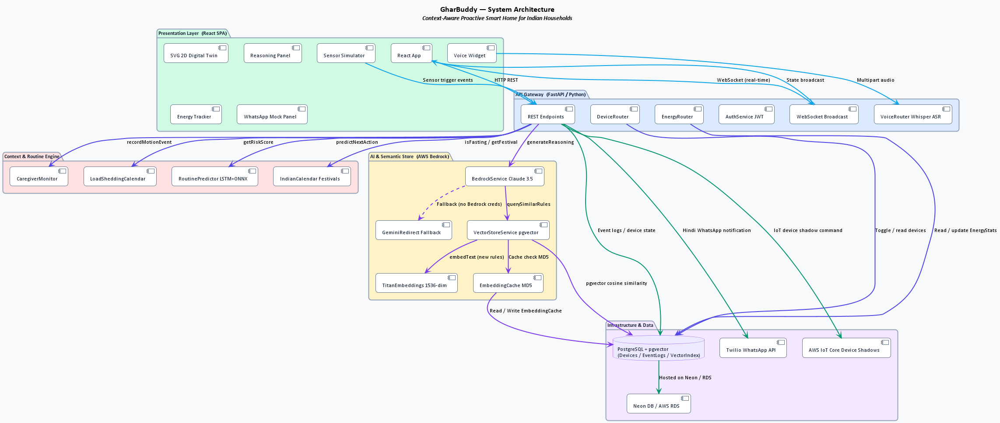
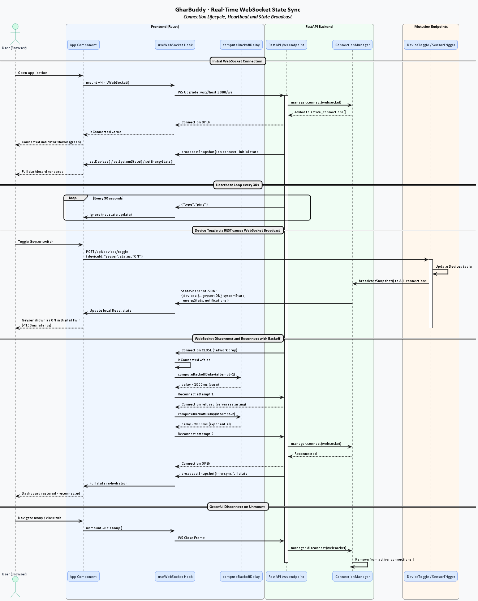

# Backend API Server

The backend engine is powered by Python and FastAPI, serving REST APIs and real-time WebSockets to synchronize all client connections.

---

## Architecture Overview

> **Full diagram source:** [`architecture.puml`](architecture.puml)

---

## Core Modules and Routers

The server functionality is split across standard routes and services:

### 1. Security and Auth Management
- Implemented in `AuthRouter.py` and `AuthService.py`.
- Generates secure JWT access tokens using HS256 HMAC signatures (`stdlib` only — no external JWT library).
- 24-hour token TTL. Handles standard credential login.
- Validates Google Client ID tokens via Google authentication libraries, automatically creating local user records.
- **Demo credentials:** `admin / gharbuddy123`, `child / child123`

### 2. Device Controllers
- Implemented in `DeviceRouter.py`.
- Updates smart appliance states (ACs, water pumps, geysers, lights) in the `Devices` PostgreSQL table.
- Broadcasts changes instantly to all active WebSocket subscribers via `ConnectionManager.broadcastSnapshot()`.

### 3. Energy Analytics
- Implemented in `EnergyRouter.py`.
- Exposes historical power utilization data from `EnergyStats`.
- Maps load-shedding schedules matching municipal cut calendars via `LoadSheddingCalendar`.

### 4. Semantic AI Services
- Implemented in `BedrockService.py` and `VectorStoreService.py`.
- Evaluates incoming home telemetry events using RAG (Retrieval-Augmented Generation).
- Formulates reasoning prompts, selecting similar user preference rules via pgvector cosine similarity.
- Uses semantic embedding cache to reduce Titan API call latency.

### 5. Caregiver Monitor
- Implemented in `CaregiverMonitor.py`.
- Monitors motion sensors during morning window (06:00 AM – 09:00 AM).
- Triggers a WhatsApp safety alert and dashboard banner if no motion is detected by 09:00 AM.

See also: [Caregiver Safety Alert Sequence Diagram](sequence-diagrams.md#2-caregiver-safety-alert)

### 6. Notification Dispatcher
- Implemented in `TwilioService.py`.
- Formats message payloads in Hindi/English and delivers WhatsApp alerts via the Twilio API.
- Sends alerts for: auto-executed actions, suggestions, safety anomalies, power cut warnings.

---

## Real-Time WebSocket Layer

All state synchronization happens over a persistent WebSocket connection at `/ws`.

> **Full diagram source:** [`sequence_websocket_sync.puml`](sequence_websocket_sync.puml)

**Connection lifecycle:**
- Client connects at `ws://host:8000/ws` → `ConnectionManager.connect()` adds socket to pool
- Server broadcasts `StateSnapshot` JSON on every mutation (toggle, trigger, override, settings)
- Heartbeat ping every 30 seconds keeps the connection alive
- Client implements exponential backoff reconnection (`computeBackoffDelay`)

---

## Data Management Layer

The backend handles dual database setups:

| Mode | Configuration | Engine |
|---|---|---|
| **Live** | `DATABASE_URL` env var set | PostgreSQL + pgvector (Neon / AWS RDS) |
| **Mock** | `DATABASE_URL` not set | In-memory SQLite (local dev, no cloud needed) |

- **Connection pooling:** `PostgreSqlService` uses `asyncpg` connection pools with configurable min/max.
- **pgvector:** Stores 1536-dimensional Titan embeddings in the `VectorIndex` table for cosine similarity retrieval.
- **Embedding cache:** `EmbeddingCache` table stores MD5-keyed vector results to skip redundant Titan API calls.
