# GharBuddy Visual Assets and Diagrams

This document compiles all visual assets for GharBuddy: UI screenshots, system architecture diagrams, workflow activity diagrams, and interaction sequence diagrams.

---

## System Diagrams

The following diagrams are auto-generated from PlantUML source files in the [`docs/`](./) directory.

### System Architecture

The complete 5-layer architecture: Presentation → API Gateway → Context Engine → AI/Semantic Layer → Infrastructure.

> Source: [`architecture.puml`](architecture.puml) | See also: [architecture.md](architecture.md)

---

### Activity Diagrams

#### Sensor Event Processing Pipeline
End-to-end flow from raw IoT sensor event through LSTM prediction, RAG retrieval, Bedrock reasoning, and confidence-gated device action.

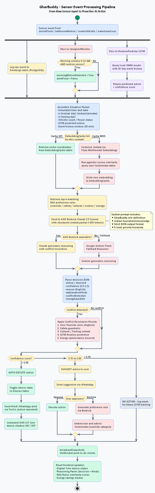

> Source: [`activity_sensor_pipeline.puml`](activity_sensor_pipeline.puml)

#### LSTM Weekly Retraining Workflow
Background daemon thread lifecycle: 7-day sleep, event log fetch, PyTorch training, validation gate, ONNX export.

> Source: [`activity_lstm_training.puml`](activity_lstm_training.puml)

#### RAG Rule Consolidation Workflow
Auto-merge overlapping preference rules using pairwise cosine similarity and Bedrock summarization.

> Source: [`activity_rag_consolidation.puml`](activity_rag_consolidation.puml)

---

### Sequence Diagrams

#### Morning Routine Automation + Override Learning
Auth → toilet flush → LSTM → RAG → Bedrock → geyser ON → WhatsApp → user decline → rule stored.

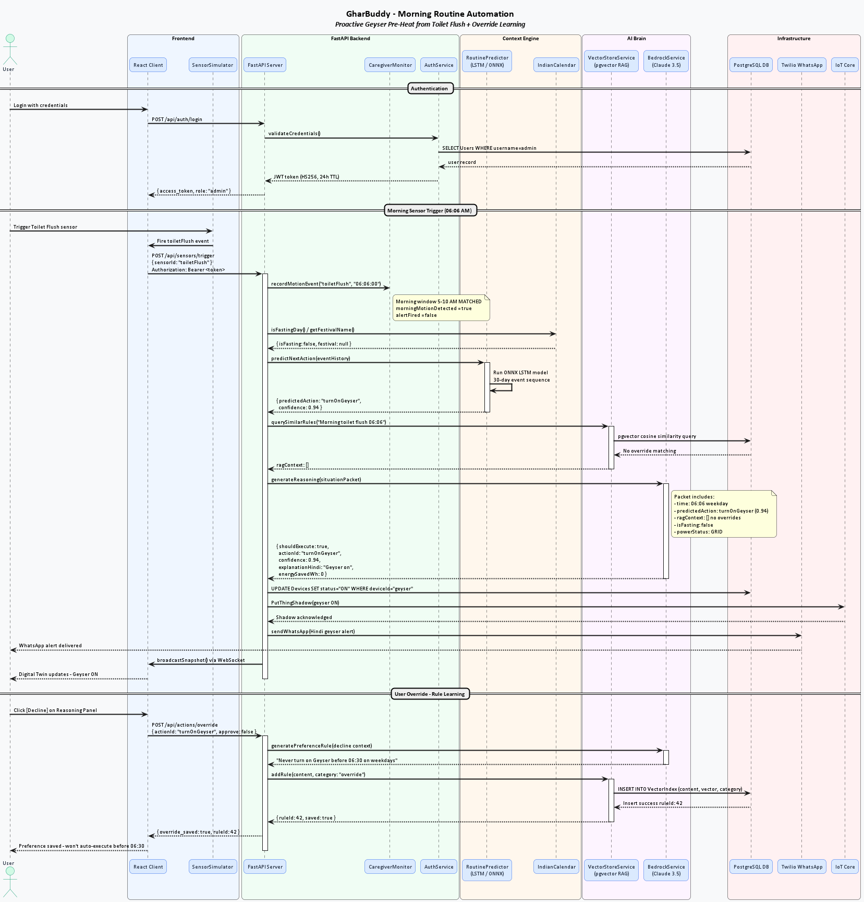

> Source: [`sequence_morning_routine.puml`](sequence_morning_routine.puml)

#### Caregiver Safety Alert
No morning motion by 9 AM → WhatsApp safety alert → red dashboard banner → monitor reset.

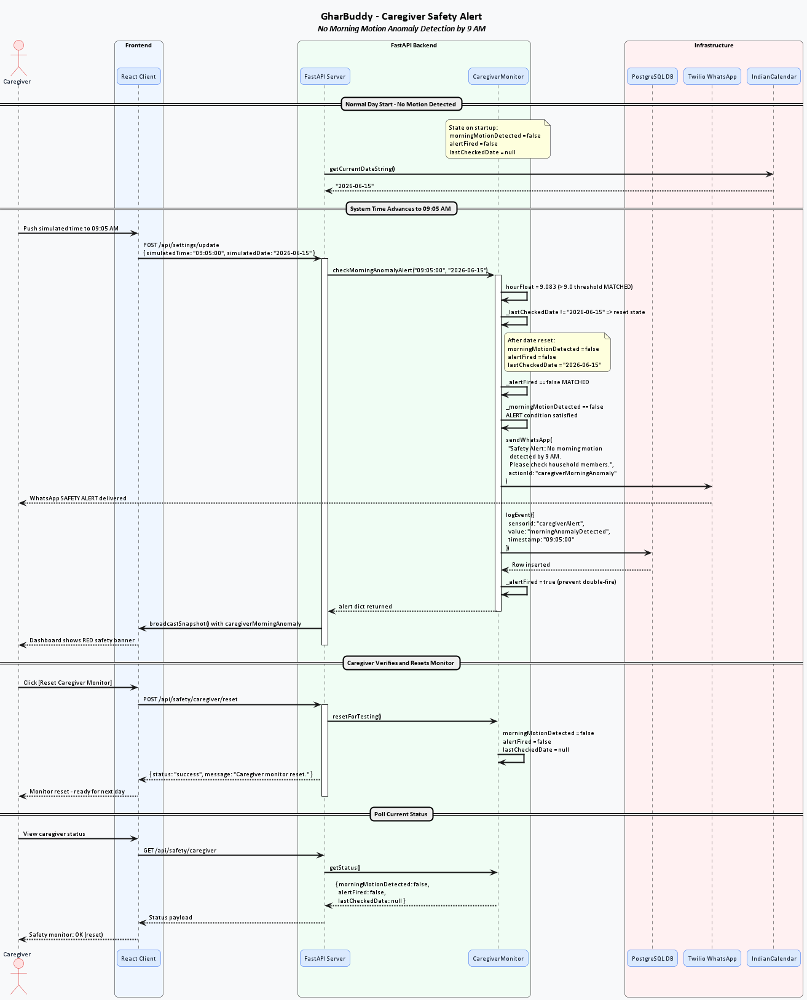

> Source: [`sequence_caregiver_alert.puml`](sequence_caregiver_alert.puml)

#### Power-Cut Recovery Mode
Load-shedding risk prediction → inverter pre-charge → power cut → INVERTER mode → power restoration.

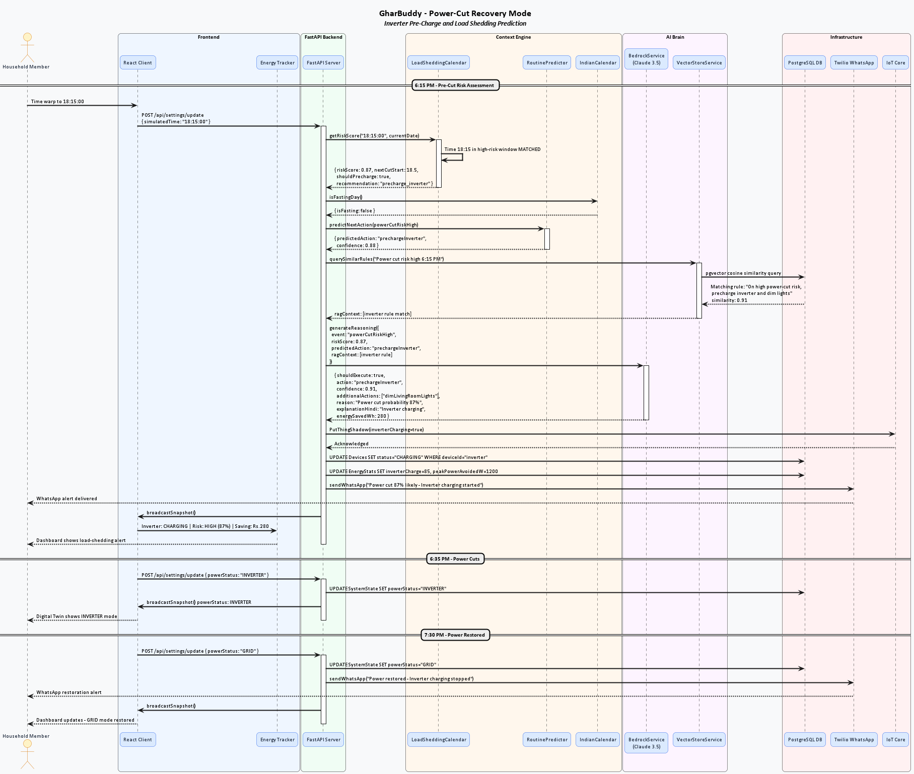

> Source: [`sequence_powercut_recovery.puml`](sequence_powercut_recovery.puml)

#### Real-Time WebSocket State Sync
WS connection lifecycle, heartbeat, mutation broadcast, exponential backoff reconnect, graceful unmount.

> Source: [`sequence_websocket_sync.puml`](sequence_websocket_sync.puml)

---

## Authentication and Security Screenshots

### 1. User Authentication Portal
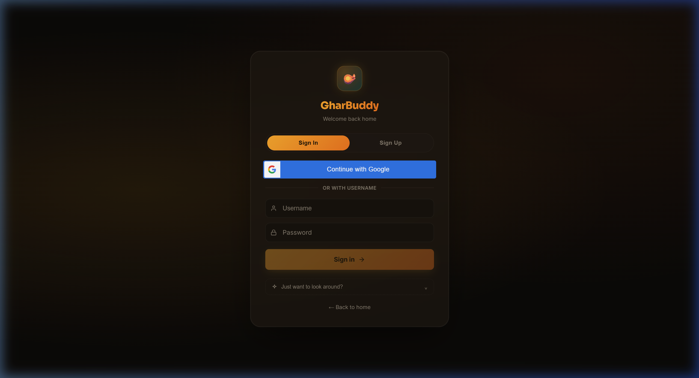
The secure login screen handles JWT credentials and integrates Google OAuth login options.

### 2. Google Sign-In Portal

The custom Google OAuth sign-in option prompts users for authorization.

### 3. Google OAuth Active Sign-In Dialog
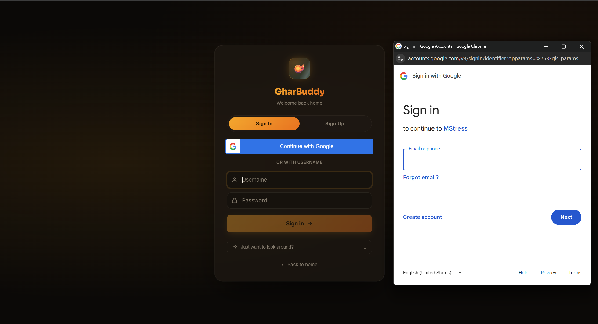
The standard Google identity service overlay requesting email and password authorizations.

---

## Smart Home Dashboard Screenshots

### 1. Home Overview Dashboard (Midnight Saffron Theme)
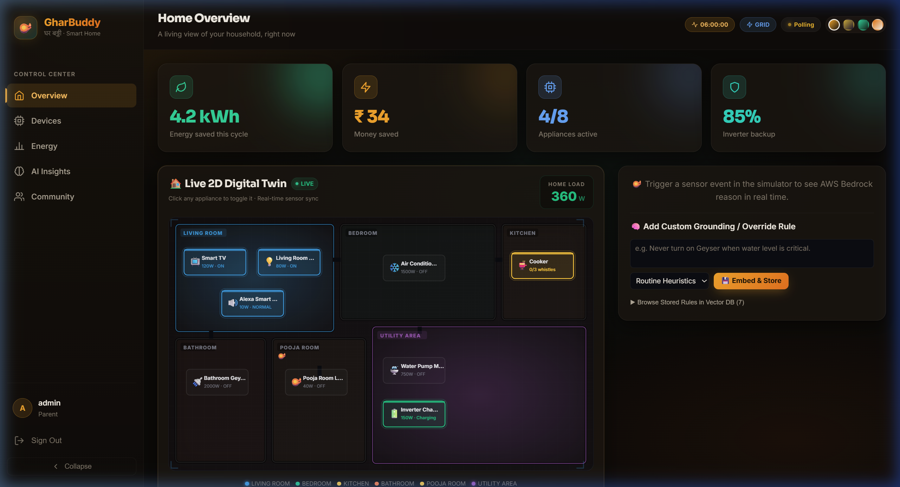
The default midnight theme rendering the interactive SVG floor plan, room occupancies, and device indicators.

### 2. Home Overview Dashboard (Dawn Light Theme)
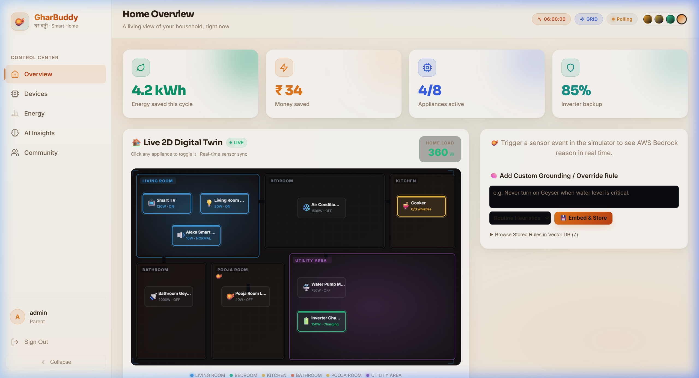
The high-contrast dawn light theme designed for daytime accessibility.

### 3. Home Overview Dashboard (Royal Indigo Theme)
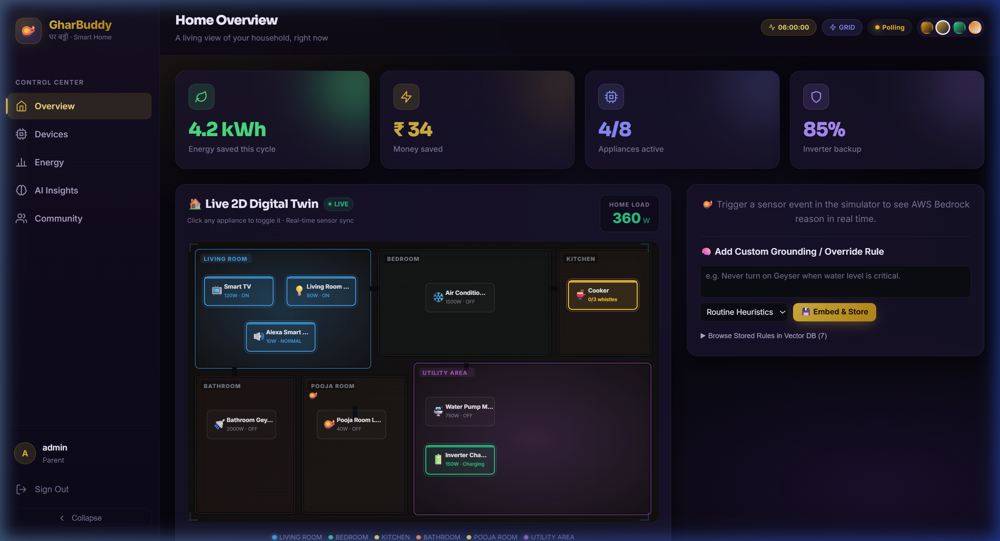
The glassmorphic royal indigo theme matching specialized evening settings.

### 4. Smart Appliances Console
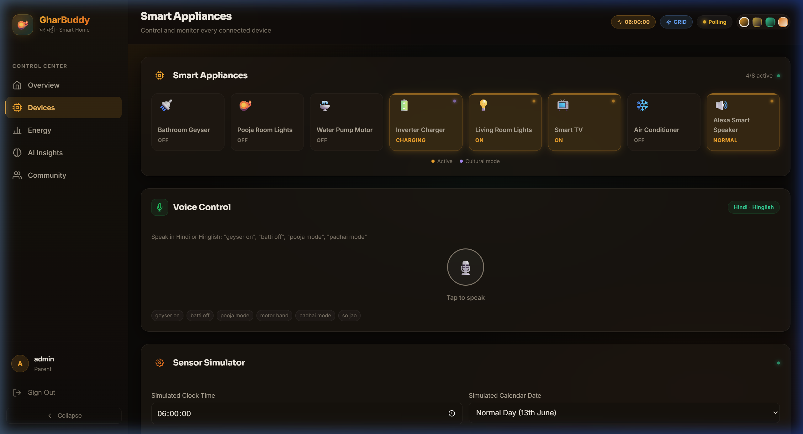
A dedicated device manager displaying real-time power consumption, toggle switches, and quick-preset activities.

### 5. Energy Analytics Control
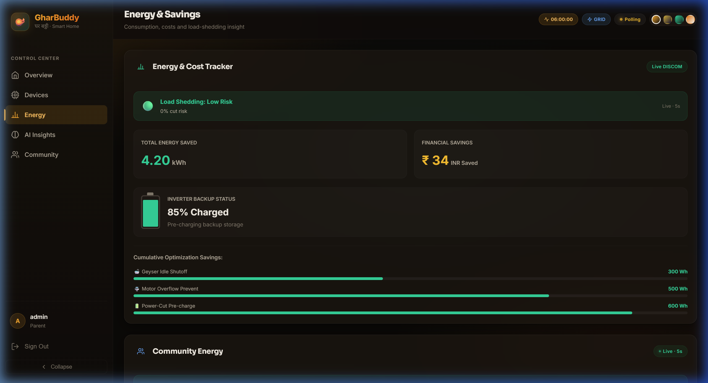
Detailed consumption histories, load-shedding lookaheads, and battery status visualizations.

### 6. Community Micro-Grid
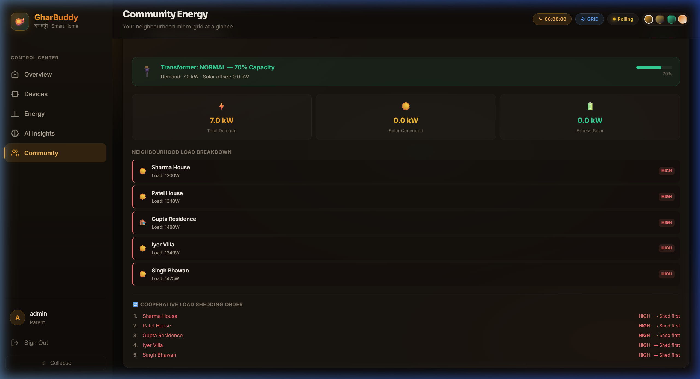
A localized dashboard simulating neighborhood solar shares, energy transfers, and active grid demand.

---

## AI Reasoning and Messaging Screenshots

### 1. AI Reasoning Insights
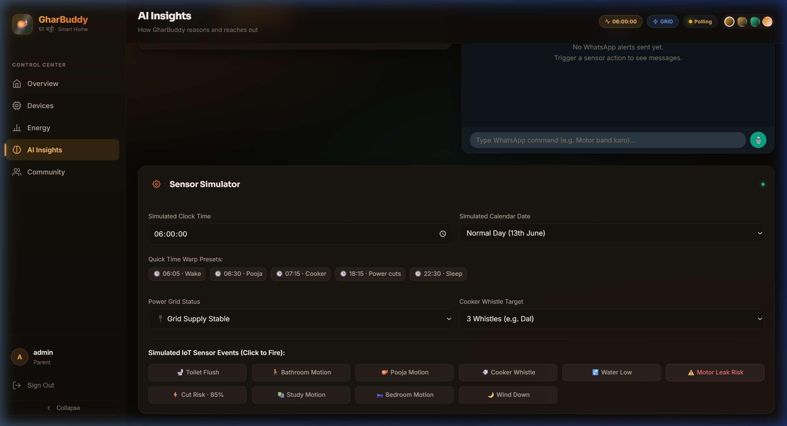
The cognitive brain of the system displaying live explainable decisions, RAG lookup indicators, and simulation triggers.

### 2. AI Agent and WhatsApp Integration
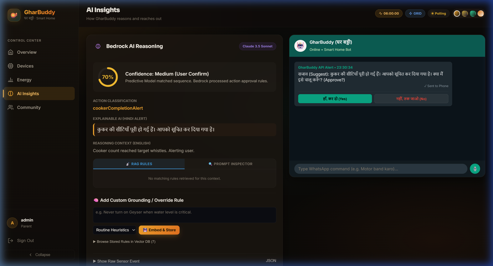
The live WhatsApp simulator sending automated alerts and request confirmations when the cooker whistle threshold is reached.

### 3. Live Twilio WhatsApp Message Delivery

A screenshot showing the actual receipt of the Twilio WhatsApp verification messages on the user mobile handset.

---

## Demo Video

### GharBuddy E2E Demo Walk-Through Video
- [gharbuddy_demo.mp4](../visuals/gharbuddy_demo.mp4): A 50-second MP4 demonstration video walking through login, theme switching, simulated sensor triggers, AI decisions, and simulated caregiver alert delivery.
